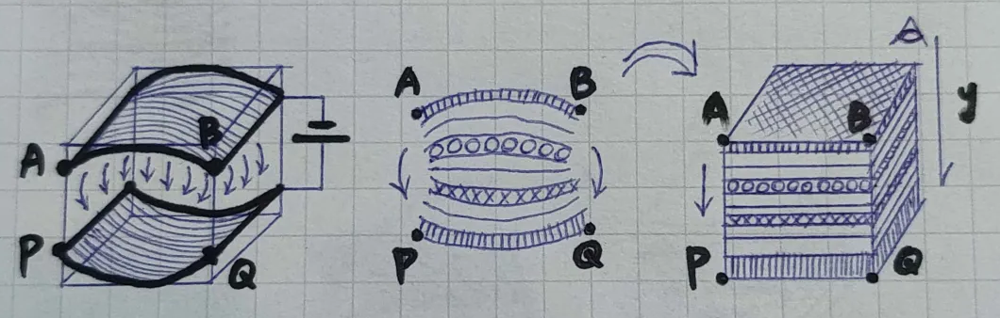
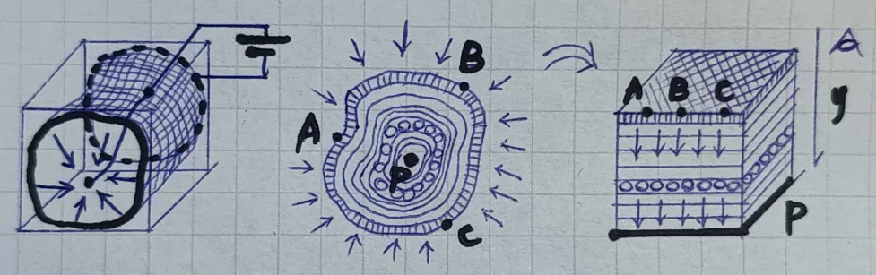
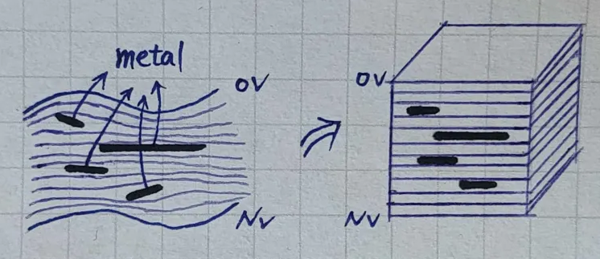

# Field-Based Visualization

This document introduces a field-based visualization approach for exploring 3D datasets. The goal is to present the core concepts, showcase initial attempts, and identify the challenges this method could help solve.

Rather than focusing on implementation details, I aim to emphasize the foundational ideas. To make the concepts more accessible, I will include a series of hand-drawn illustrations that provide clear explanations for anyone interested in developing their own implementations or optimizations.

---

## Concept

Imagine you have a 3D grid dataset. How would you visualize it? The most straightforward method might involve slicing through the data along the x, y, or z axes, as shown below:  

  

Now, let's reframe this exploration method. Imagine placing two parallel plates at the ends of the grid that generate an electric field. This field creates potential gradient lines across the grid, as illustrated here:  

  

In this perspective, users navigate the data by following the equipotential lines generated by the electric field.  

---

## Advantages of Field-Based Navigation

This approach allows for a new way of thinking about data exploration. By redefining the shape of the electrodes, you can control how the data is visualized. For example:  

### Flat Electrode Configuration  
  

### Ring Electrode Configuration  
  

The benefits of this visualization method include:  
1. **Customizable Navigation:** The user can define electrode shapes to align with specific surfaces of interest.  
2. **Continuous Exploration:** There's no need to explicitly define every surface detail between the electrodes, offering a smooth browsing experience.  

---

## Adaptive Potential via Internal Features

Often, datasets contain features such as surfaces, edges, fibers, or segments that are of particular interest. These features can be treated as conductive layers (metal plates), ensuring that the electric potential across these surfaces is nearly constant.  

By aligning the internal potential field with these features, users can intuitively navigate the dataset along the normal directions of these surfaces. For example:  

  

This method allows data exploration aligned with its inherent structures, offering insights that may be less apparent with traditional slicing methods. 

